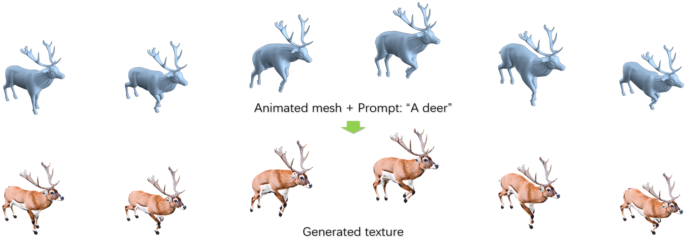

# 4OTex: 4D Object Texturing from Diffusion Priors

  

&nbsp;&nbsp;

# Pipeline

The following diagram illustrates the pipeline of 4OTex:

  

# Results

## Qualitative Results
  

## Quantitative Results

    

## Video Demonstration
To see the results in animation, check out the video below:

[Watch the video results here](./static/final_video_Qianru_Yunfei_4OTex.mp4)
*(Click the link to view the video)*

# Code coming soon ...

# Acknowledgements

We thank Prof. Dr. Matthias Nießner for his insightful advice during the project period.
